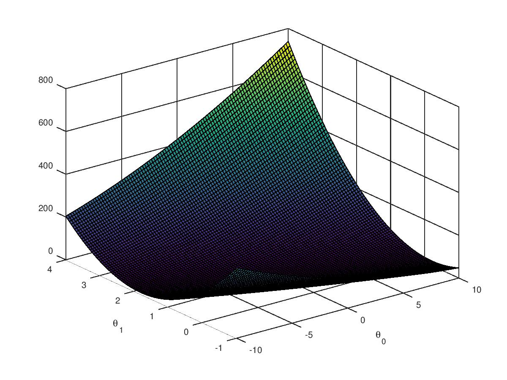

# Machine Learning Course from Coursera
This repository consist of assignments of Machine learning course from [Coursera](https://www.coursera.org/learn/machine-learning/). Programming language used for these assignments are implemented in [Octave](https://www.gnu.org/software/octave/). However source codes can be executed on Matlab. Synatx for matlab and Octave are almost same.

## Programming Assignment - 1
This assignment consist of implementation of Linear regression on data. 


```Source code
ex1.m file contain the implementation of assignment evaluation script. 
It calls other script and displays implementation of different modules.
```

**1. warmUpExercise.m**
	- Generates identity matrix of size 5. <br/>
	- 	```	1   0   0   0   0  
			0   1   0   0   0  
			0   0   1   0   0   
			0   0   0   1   0   
			0   0   0   0   1   
		```

**2. plotData.m**
	
	- Plot input data to visualize the structure that might help in modelling the parameters.
	  This scripts read data from file and plot input feature against output value.


**3. computeCost.m**
	
	- While performing gradient descent algorithm, visualizing cost function gives better understanding of data convergence.
	- Linear regression algorithm computes cost by taking square of difference of predicted value and actual value
		(h(theta) - y)^2
	- **computeCost.m** script implements calculation of cost function for linear regression.

**4. gradientDescent.m**
	
	- Gradient descent algorithm tries to minimize the cost function calculated in above steps,
	  by optimizing the unknown parameters.
	- This function implemets gradient descent algorithm.

**5. Visualization**
	
	- With every iteration of Gradient descent algorithm, cost function decreases with specified learning rate.
	- Learning rate can be fixed or variable, mostly depends on the kind of data.
	- learning rate of gradient descent can be set by playing around with it.
	- Below shows the expected phenomenon occured while training data.



```Source code
ex1_multi.m file contain the implementation of assignment evaluation script for multi feature data.
It calls other script and displays implementation of different modules.
```
**1. featureNormalize.m**
	
	- For training data with mutiple variable, feature nomalization brings all input feature in some ranges.
	- Gradient descent to work better for normalized data and convergence becomes faster.
	- This scripts performs normalization of data using (x-mu)/sigma formula. mu = average, sigma = (max val - min val)

**2. computeCostMulti.m**
	
	- Computes cost for multiple features in training set.
	- Vectorized implementation.

**3. gradientDescentMulti.m**
	
	- Vectorized Implemntation of gradient descent algorithm for multiple feature training data.

**4. Visualization**
	
	- With every iteration of Gradient descent algorithm, cost function decreases with specified learning rate.
	- Below shows the expected phenomenon occured while training data with multiple feature.


